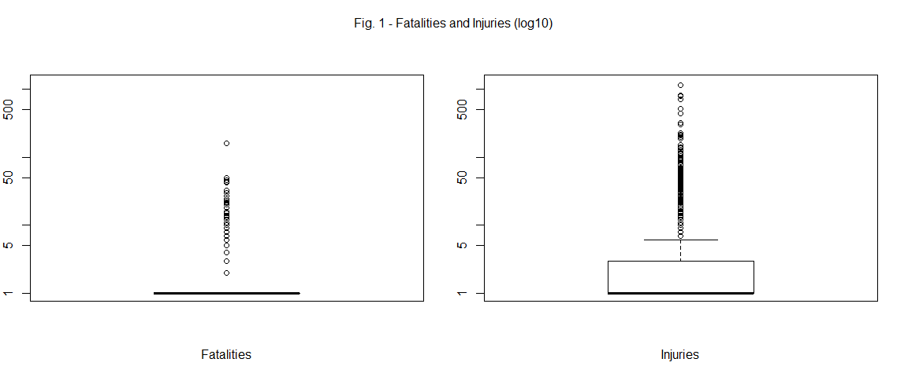
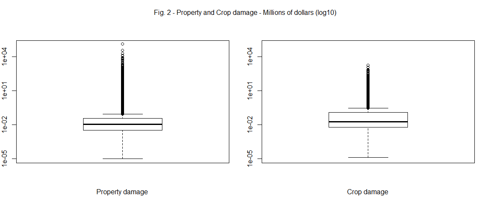

Impact of major weather events in the United States between 2001 and 2011
=========================================================================

## Synopsis

In this report we analyse the public health and economic impact of storms and
other major weather events in United States. Many of such severe events can
result in fatalities, injuries, crop and property damage, and preventing such
outcomes is a key concern for federal and state government and for municipalities.

We explored the U.S. National Oceanic and Atmospheric Administration's (NOAA) storm
database and, using the data from 2001 to 2011, we found which type of event
had most health and economic impact in those 10 years span.

This report could be of interest to government or municipal managers who might be
responsible for preparing for severe weather events and will need to prioritize
resources for different types of events.

Note: this report was made as an assignment for the [Reproducible Research](https://www.coursera.org/course/repdata)
Coursera course. The report is made with [RMarkdown](http://rmarkdown.rstudio.com/)
and [Knitr](http://yihui.name/knitr/).
The source code is available on [github](https://github.com/muhammadhanifbaharudin/RepData_PeerAssessment2.git)

## Data Processing


### Reading the data

The [U.S. National Oceanic and Atmospheric Administration's (NOAA) storm database](http://www.ncdc.noaa.gov/stormevents/)
tracks characteristics of major storms and weather events in the United States,
including when and where they occur, as well as estimates of any fatalities,
injuries, and property damage.
The events in the database start in the year 1950 and end in November 2011.

We obtain a compressed file from the Coursera course site: [Storm data](https://d396qusza40orc.cloudfront.net/repdata%2Fdata%2FStormData.csv.bz2) 
[47Mb], and we read the raw text file included.


```r
if(!dir.exists("data")){dir.create("data")}
fileurl = "https://d396qusza40orc.cloudfront.net/repdata%2Fdata%2FStormData.csv.bz2"
download.file(fileurl, destfile = "data/StormData.csv.bz2")
df_raw = read.csv(bzfile("data/StormData.csv.bz2"))
rm(fileurl)
```

First, we analyse the columns.


```r
colnames(df_raw)
```

```
##  [1] "STATE__"    "BGN_DATE"   "BGN_TIME"   "TIME_ZONE"  "COUNTY"    
##  [6] "COUNTYNAME" "STATE"      "EVTYPE"     "BGN_RANGE"  "BGN_AZI"   
## [11] "BGN_LOCATI" "END_DATE"   "END_TIME"   "COUNTY_END" "COUNTYENDN"
## [16] "END_RANGE"  "END_AZI"    "END_LOCATI" "LENGTH"     "WIDTH"     
## [21] "F"          "MAG"        "FATALITIES" "INJURIES"   "PROPDMG"   
## [26] "PROPDMGEXP" "CROPDMG"    "CROPDMGEXP" "WFO"        "STATEOFFIC"
## [31] "ZONENAMES"  "LATITUDE"   "LONGITUDE"  "LATITUDE_E" "LONGITUDE_"
## [36] "REMARKS"    "REFNUM"
```

We are interested in the following columns.

#### BGN_DATE

Begin date of the event. The events could span many days, but for our purposes
we date them with the begin date. We extract the year and we will use it to
filter the events registered between 2001 and 2011 as the last 10 years of data is sufficient enough to evaluate which are the most impactful type of events

#### EVTYPE

The NOAA storm database code book reports 48 event type. The event types in the data set
are more than 9 hundred.


```r
length(unique(df_raw$EVTYPE))
```

```
## [1] 985
```

Some difference are caused by upper and lower cases, but many of them are caused by
incorrect imputation, especially in the early years.
There is not an easy way to correct them so we looked for event types with 
big values for fatalities and damage and use regular expression substitution
to correct them. 


```r
df_corrected = df_raw
df_corrected$EVTYPE = toupper(df_corrected$EVTYPE)
df_corrected$EVTYPE = gsub("^(SMALL )?HAIL.*", "HAIL", df_corrected$EVTYPE)
df_corrected$EVTYPE = gsub("TSTM|THUNDERSTORMS?", "THUNDERSTORM", df_corrected$EVTYPE)
df_corrected$EVTYPE = gsub("STORMS?", "STORM", df_corrected$EVTYPE)
df_corrected$EVTYPE = gsub("WINDS?|WINDS?/HAIL", "WIND", df_corrected$EVTYPE)
df_corrected$EVTYPE = gsub("RAINS?", "RAIN", df_corrected$EVTYPE)
df_corrected$EVTYPE = gsub("^TH?UN?DEE?RS?TO?RO?M ?WIND.*|^(SEVERE )?THUNDERSTORM$|^WIND STORM$|^(DRY )?MI[CR][CR]OBURST.*|^THUNDERSTORMW$", "THUNDERSTORM WIND", df_corrected$EVTYPE)
df_corrected$EVTYPE = gsub("^COASTAL ?STORM$|^MARINE ACCIDENT$", "MARINE THUNDERSTORM WIND", df_corrected$EVTYPE)
df_corrected$EVTYPE = gsub("^FLOODS?.*|^URBAN/SML STREAM FLD$|^(RIVER|TIDAL|MAJOR|URBAN|MINOR|ICE JAM|RIVER AND STREAM|URBAN/SMALL STREAM)? FLOOD(ING)?S?$|^HIGH WATER$|^URBAN AND SMALL STREAM FLOODIN$|^DROWNING$|^DAM BREAK$", "FLOOD", df_corrected$EVTYPE)
df_corrected$EVTYPE = gsub("^FLASH FLOOD.*|^RAPIDLY RISING WATER$", "FLASH FLOOD", df_corrected$EVTYPE)
df_corrected$EVTYPE = gsub("WATERSPOUTS?", "WATERSPOUT", df_corrected$EVTYPE)
df_corrected$EVTYPE = gsub("WEATHER/MIX", "WEATHER", df_corrected$EVTYPE)
df_corrected$EVTYPE = gsub("CURRENTS?", "CURRENT", df_corrected$EVTYPE)
df_corrected$EVTYPE = gsub("^WINDCHILL$|^COLD.*|^LOW TEMPERATURE$|^UNSEASONABLY COLD$", "COLD/WIND CHILL", df_corrected$EVTYPE)
df_corrected$EVTYPE = gsub("^EXTREME WIND ?CHILL$|^(EXTENDED|EXTREME|RECORD)? COLDS?$", "EXTREME COLD/WIND CHILL", df_corrected$EVTYPE)
df_corrected$EVTYPE = gsub("^WILD/FOREST FIRE$|^(WILD|BRUSH|FOREST)? ?FIRES?$", "WILDFIRE", df_corrected$EVTYPE)
df_corrected$EVTYPE = gsub("^RAIN/SNOW$|^(BLOWING|HEAVY|EXCESSIVE|BLOWING|ICE AND|RECORD)? ?SNOWS?.*", "HEAVY SNOW", df_corrected$EVTYPE)
df_corrected$EVTYPE = gsub("^FOG$", "DENSE FOG", df_corrected$EVTYPE)
df_corrected$EVTYPE = gsub("^(GUSTY|NON-SEVERE|NON ?-?THUNDERSTORM)? ?WIND.*|^ICE/STRONG WIND$", "STRONG WIND", df_corrected$EVTYPE)
df_corrected$EVTYPE = gsub("SURGE$", "SURGE/TIDE", df_corrected$EVTYPE)
df_corrected$EVTYPE = gsub("CLOUDS?", "CLOUD", df_corrected$EVTYPE)
df_corrected$EVTYPE = gsub("^FROST[/\\]FREEZE$|^FROST$|^(DAMAGING)? ?FREEZE$|^HYP[OE]R?THERMIA.*|^ICE$|^(ICY|ICE) ROADS$|^BLACK ICE$|^ICE ON ROAD$", "FROST/FREEZE", df_corrected$EVTYPE)
df_corrected$EVTYPE = gsub("^GLAZE.*|^FREEZING (RAIN|DRIZZLE|RAIN/SNOW|SPRAY$)$|^WINTRY MIX$|^MIXED PRECIP(ITATION)?$|^WINTER WEATHER MIX$|^LIGHT SNOW$|^FALLING SNOW/ICE$|^SLEET.*", "SLEET", df_corrected$EVTYPE)
df_corrected$EVTYPE = gsub("^HURRICANE.*", "HURRICANE/TYPHOON", df_corrected$EVTYPE)
df_corrected$EVTYPE = gsub("^HEAT WAVES?$|^UNSEASONABLY WARM$|^WARM WEATHER$", "HEAT", df_corrected$EVTYPE)
df_corrected$EVTYPE = gsub("^(EXTREME|RECORD/EXCESSIVE|RECORD) HEAT$", "EXCESSIVE HEAT", df_corrected$EVTYPE)
df_corrected$EVTYPE = gsub("^HEAVY SURF(/HIGH SURF)?.*$|^(ROUGH|HEAVY) SEAS?.*|^(ROUGH|ROGUE|HAZARDOUS) SURF.*|^HIGH WIND AND SEAS$|^HIGH SURF.*", "HIGH SURF", df_corrected$EVTYPE)
df_corrected$EVTYPE = gsub("^LAND(SLUMP|SLIDE)?S?$|^MUD ?SLIDES?$|^AVALANCH?E$", "AVALANCHE", df_corrected$EVTYPE)
df_corrected$EVTYPE = gsub("^UNSEASONABLY WARM AND DRY$|^DROUGHT.*|^HEAT WAVE DROUGHT$", "DROUGHT", df_corrected$EVTYPE)
df_corrected$EVTYPE = gsub("^TORNADO.*", "TORNADO", df_corrected$EVTYPE)
df_corrected$EVTYPE = gsub("^TROPICAL STORM.*", "TROPICAL STORM", df_corrected$EVTYPE)
df_corrected$EVTYPE = gsub("^MARINE MISHAP$|^HIGH WIND/SEAS$", "MARINE HIGH WIND", df_corrected$EVTYPE)
df_corrected$EVTYPE = gsub("^HIGH WIND.*", "HIGH WIND", df_corrected$EVTYPE)
df_corrected$EVTYPE = gsub("^HIGH SEAS$", "MARINE STRONG WIND", df_corrected$EVTYPE)
df_corrected$EVTYPE = gsub("^RIP CURRENT.*", "RIP CURRENT", df_corrected$EVTYPE)
df_corrected$EVTYPE = gsub("^WATERSPOUT.*", "WATERSPOUT", df_corrected$EVTYPE)
df_corrected$EVTYPE = gsub("^EXCESSIVE RAINFALL$|^RAIN.*|^TORRENTIAL RAINFALL$|^(HEAVY|HVY)? (RAIN|MIX|PRECIPITATION).*", "HEAVY RAIN", df_corrected$EVTYPE)
df_corrected$EVTYPE = gsub("^FOG.*", "FREEZING FOG", df_corrected$EVTYPE)
df_corrected$EVTYPE = gsub("^WINTER STORM.*", "WINTER STORM", df_corrected$EVTYPE)
df_corrected$EVTYPE = gsub("^THUNDERSNOW$|^ICE STORM.*", "ICE STORM", df_corrected$EVTYPE)
df_corrected$EVTYPE = gsub("WAVES?|SWELLS?", "SURF", df_corrected$EVTYPE)
df_corrected$EVTYPE = gsub("^LIGHTNING.*", "LIGHTNING", df_corrected$EVTYPE)
df_corrected$EVTYPE = gsub("^WHIRLWIND$|^GUSTNADO$|^TORNDAO$", "TORNADO", df_corrected$EVTYPE)
df_corrected$EVTYPE = gsub("^COASTAL FLOOD.*", "COASTAL FLOOD", df_corrected$EVTYPE)
df_corrected$EVTYPE = gsub("^TYPHOON", "HURRICANE/TYPHOON", df_corrected$EVTYPE)
df_corrected$EVTYPE = gsub("^EROSION/CSTL FLOOD$|^COASTAL FLOOD/EROSION$|^COASTAL SURGE/TIDE$", "COASTAL FLOOD", df_corrected$EVTYPE)
df_corrected$EVTYPE = gsub("^ASTRONOMICAL HIGH TIDE$", "STORM SURGE/TIDE", df_corrected$EVTYPE)
df_corrected$EVTYPE = gsub("^(GROUND)? ?BLIZZARD.*$", "BLIZZARD", df_corrected$EVTYPE)
df_corrected$EVTYPE = gsub("^DUST STORM.*$", "DUST STORM", df_corrected$EVTYPE)
```

#### FATALITIES and INJURIES

Fatalities and injuries estimated for the event. These values are used to estimate
the public health impact for type of events.

#### PROPDMG and CROPDMG

Property and crop damage estimated for the event. These values are used to estimate
the economic impact for type of events.

##### Exponent

These variables are associated with PROPDMGEXP and CROPDMGEXP which are used
as exponents to interpret the numeric values for the damage. There are not much
information in the data code book about these variables.

The only symbols with a clear meaning are:

* H or h: for hundredth of dollars
* K or k: for thousands of dollars
* M or m: for million of dollars
* B or b: for billion of dollars

We sum the damage values grouped by the symbols.


```r
property_data_exp = df_raw %>%
  group_by(PROPDMGEXP) %>%
  summarise(property_damage_per_exp = sum(PROPDMG)) %>%
  arrange(PROPDMGEXP)
print(xtable(property_data_exp), type="html")
```

<!-- html table generated in R 3.6.1 by xtable 1.8-4 package -->
<!-- Mon Sep 07 03:14:09 2020 -->
<table border=1>
<tr> <th>  </th> <th> PROPDMGEXP </th> <th> property_damage_per_exp </th>  </tr>
  <tr> <td align="right"> 1 </td> <td>  </td> <td align="right"> 527.41 </td> </tr>
  <tr> <td align="right"> 2 </td> <td> - </td> <td align="right"> 15.00 </td> </tr>
  <tr> <td align="right"> 3 </td> <td> ? </td> <td align="right"> 0.00 </td> </tr>
  <tr> <td align="right"> 4 </td> <td> + </td> <td align="right"> 117.00 </td> </tr>
  <tr> <td align="right"> 5 </td> <td> 0 </td> <td align="right"> 7108.30 </td> </tr>
  <tr> <td align="right"> 6 </td> <td> 1 </td> <td align="right"> 0.00 </td> </tr>
  <tr> <td align="right"> 7 </td> <td> 2 </td> <td align="right"> 12.00 </td> </tr>
  <tr> <td align="right"> 8 </td> <td> 3 </td> <td align="right"> 20.00 </td> </tr>
  <tr> <td align="right"> 9 </td> <td> 4 </td> <td align="right"> 14.50 </td> </tr>
  <tr> <td align="right"> 10 </td> <td> 5 </td> <td align="right"> 210.50 </td> </tr>
  <tr> <td align="right"> 11 </td> <td> 6 </td> <td align="right"> 65.00 </td> </tr>
  <tr> <td align="right"> 12 </td> <td> 7 </td> <td align="right"> 82.00 </td> </tr>
  <tr> <td align="right"> 13 </td> <td> 8 </td> <td align="right"> 0.00 </td> </tr>
  <tr> <td align="right"> 14 </td> <td> B </td> <td align="right"> 275.85 </td> </tr>
  <tr> <td align="right"> 15 </td> <td> h </td> <td align="right"> 2.00 </td> </tr>
  <tr> <td align="right"> 16 </td> <td> H </td> <td align="right"> 25.00 </td> </tr>
  <tr> <td align="right"> 17 </td> <td> K </td> <td align="right"> 10735292.10 </td> </tr>
  <tr> <td align="right"> 18 </td> <td> m </td> <td align="right"> 38.90 </td> </tr>
  <tr> <td align="right"> 19 </td> <td> M </td> <td align="right"> 140694.45 </td> </tr>
   </table>

```r
crop_data_exp = df_raw %>%
  group_by(CROPDMGEXP) %>%
  summarise(crop_damage_per_exp = sum(CROPDMG)) %>%
  arrange(CROPDMGEXP)
print(xtable(crop_data_exp), type="html")
```

<!-- html table generated in R 3.6.1 by xtable 1.8-4 package -->
<!-- Mon Sep 07 03:14:09 2020 -->
<table border=1>
<tr> <th>  </th> <th> CROPDMGEXP </th> <th> crop_damage_per_exp </th>  </tr>
  <tr> <td align="right"> 1 </td> <td>  </td> <td align="right"> 11.00 </td> </tr>
  <tr> <td align="right"> 2 </td> <td> ? </td> <td align="right"> 0.00 </td> </tr>
  <tr> <td align="right"> 3 </td> <td> 0 </td> <td align="right"> 260.00 </td> </tr>
  <tr> <td align="right"> 4 </td> <td> 2 </td> <td align="right"> 0.00 </td> </tr>
  <tr> <td align="right"> 5 </td> <td> B </td> <td align="right"> 13.61 </td> </tr>
  <tr> <td align="right"> 6 </td> <td> k </td> <td align="right"> 436.00 </td> </tr>
  <tr> <td align="right"> 7 </td> <td> K </td> <td align="right"> 1342955.91 </td> </tr>
  <tr> <td align="right"> 8 </td> <td> m </td> <td align="right"> 10.00 </td> </tr>
  <tr> <td align="right"> 9 </td> <td> M </td> <td align="right"> 34140.80 </td> </tr>
   </table>

We see that the symbols without a clear meaning are associated with minimal
values. So we use only the H, K, M, B symbols to interpret the damage amounts
and we clear the amounts for the other symbols.

We create a function to decode the symbols and return a multiplier for the amounts.
We use as base value the million of dollars, as we are interested only in the
most impactful damage. This function will be used to prepare the final data set.


```r
# Function to decode the EXP symbol
decode_exp = function(exp_symbol) {
  # Normalize to millions of dollars
  if (toupper(exp_symbol) == "B") exp =1000
  else if (toupper(exp_symbol) == "M") exp =1
  else if (toupper(exp_symbol) == "K") exp = 1/1000
  else if (toupper(exp_symbol) == "H") exp = 1/10000
  # Don't know how to interpet other values
  else exp =0
  return(exp)
}
decode_exp_v = Vectorize(decode_exp)
```

##### Constant dollars

To add up and compare amounts of different years, we have to convert them in
[constant dollars](http://en.wikipedia.org/wiki/Constant_dollars), i.e. inflation
adjusted amounts. 

To compute a conversion factor for each year, we download the 
[Consumer Price Index for All Urban Consumers: All Items](http://research.stlouisfed.org/fred2/series/CPIAUCSL)
from [Federal Reserve Economic Data](http://research.stlouisfed.org/fred2/),
we average the monthly CPI to obtain an annual value, and we compute a factor
based at 2011 that could be multiplied with the amounts to adjust for the inflation.


```r
# Get Consumer Price Index from Federal Reserve Economic Data
getSymbols("CPIAUCSL", src='FRED')
# CPI is monthly. Calculate an annual average.
annual_cpi = apply.yearly(CPIAUCSL, mean)
# Calculate conversion factor using 2011 as the base year
conversion_factor = 1 / annual_cpi * as.numeric(annual_cpi['2011'])
```

### Final dataset

The final data set, used for the analysis, is obtained by:

* filtering the 2001-2011 events
* applying the exponent and the constant dollars factor to the property and crop amounts
* renaming the variables to make them clearer


```r
df = df_corrected %>%
  filter(year(mdy_hms(BGN_DATE)) >= 2001) %>%
  mutate(property_damage_exp = decode_exp_v(PROPDMGEXP)
        ,crop_damage_exp = decode_exp_v(CROPDMGEXP)
        ,event_year = year(mdy_hms(BGN_DATE))
        ,factor_cd = as.numeric(conversion_factor[as.character(event_year)])
        ,property_damage = PROPDMG * property_damage_exp * factor_cd
        ,crop_damage = CROPDMG * crop_damage_exp * factor_cd) %>%
  select(event_year
        ,event_type = EVTYPE
        ,fatalities = FATALITIES
        ,injuries = INJURIES
        ,property_damage
        ,crop_damage)
```


```r
df_final_dim = dim(df)
df_final_dim
```

[1] 488692      6

```r
print(xtable(head(df), digits = c(0,0,0,0,0,6,6)), type = "html")
```

<!-- html table generated in R 3.6.1 by xtable 1.8-4 package -->
<!-- Mon Sep 07 03:32:37 2020 -->
<table border=1>
<tr> <th>  </th> <th> event_year </th> <th> event_type </th> <th> fatalities </th> <th> injuries </th> <th> property_damage </th> <th> crop_damage </th>  </tr>
  <tr> <td align="right"> 1 </td> <td align="right"> 2001 </td> <td> THUNDERSTORM WIND </td> <td align="right"> 0 </td> <td align="right"> 0 </td> <td align="right"> 0.002541 </td> <td align="right"> 0.000000 </td> </tr>
  <tr> <td align="right"> 2 </td> <td align="right"> 2001 </td> <td> THUNDERSTORM WIND </td> <td align="right"> 0 </td> <td align="right"> 0 </td> <td align="right"> 0.019057 </td> <td align="right"> 0.000000 </td> </tr>
  <tr> <td align="right"> 3 </td> <td align="right"> 2001 </td> <td> HAIL </td> <td align="right"> 0 </td> <td align="right"> 0 </td> <td align="right"> 0.000000 </td> <td align="right"> 0.000000 </td> </tr>
  <tr> <td align="right"> 4 </td> <td align="right"> 2001 </td> <td> THUNDERSTORM WIND </td> <td align="right"> 0 </td> <td align="right"> 0 </td> <td align="right"> 0.006352 </td> <td align="right"> 0.000000 </td> </tr>
  <tr> <td align="right"> 5 </td> <td align="right"> 2001 </td> <td> THUNDERSTORM WIND </td> <td align="right"> 0 </td> <td align="right"> 0 </td> <td align="right"> 0.006352 </td> <td align="right"> 0.000000 </td> </tr>
  <tr> <td align="right"> 6 </td> <td align="right"> 2001 </td> <td> THUNDERSTORM WIND </td> <td align="right"> 0 </td> <td align="right"> 0 </td> <td align="right"> 0.003811 </td> <td align="right"> 0.000000 </td> </tr>
   </table>

The final data set contains 488692 events and 6 variables.

## Results

The analysis aims to answer two question:

* Across the United States, which types of events are most harmful with respect to population health?
* Across the United States, which types of events have the greatest economic consequences?

### Which types of events are most harmful?

We consider as "harmful to population health"" the events with registered fatalities
and injuries.

We select only the events with fatalities and injuries.


```r
fatalities_registered = df[df$fatalities != 0, 3]
injuries_registered = df[df$injuries != 0, 4]
fatalities_registered_sum = sum(fatalities_registered)
injuries_registered_sum = sum(injuries_registered)
summary(fatalities_registered)
```

```
##    Min. 1st Qu.  Median    Mean 3rd Qu.    Max. 
##   1.000   1.000   1.000   1.708   1.000 158.000
```

```r
summary(injuries_registered)
```

```
##     Min.  1st Qu.   Median     Mean  3rd Qu.     Max. 
##    1.000    1.000    1.000    5.719    3.000 1150.000
```

We can see that in the 2001-2011 period were registered 5517
fatalities and 32330 injuries.

The distribution of fatalities has a median of 1, a third quartile of 1 and a max
value of 158. This mean that more than the 75% of the events have 1 fatalities
and there are few events with a large number of fatalities.

Injuries has a similar distribution with a median of 1, a third quartile of 3
and a max value of 1150.

We can visually confirm these distribution with a boxplot of fatalities and injuries
(figure 1).
As the distribution is highly skewed towards 1, we have plotted the y axis as
the logarithm in base 10 of fatalities and injuries to make the distribution clearer.


```r
par(mfrow=c(1,2), mar=c(5,2,2,2), oma=c(0,0,3,0))
boxplot(fatalities_registered, log = "y", xlab = "Fatalities", ylim = c(1,1200))
boxplot(injuries_registered, log = "y", xlab = "Injuries", ylim = c(1,1200))
mtext("Fig. 1 - Fatalities and Injuries (log10)", side=3, line=1, outer=TRUE)
```

<!-- -->

We find out the top 10 event types by fatalities and we compute the average
number of fatalities per event types. For all the event type the average is less
than 1.


```r
event_type_fatalities_summary = df %>%
  group_by(event_type) %>%
  summarise(fatalities_per_type = sum(fatalities), event_count = n()) %>%
  mutate(average_fatalities = fatalities_per_type / event_count) %>%
  arrange(desc(fatalities_per_type, event_count))
print(xtable(head(event_type_fatalities_summary, n = 10), digits = c(0,0,0,0,2)), type="html")
```

<!-- html table generated in R 3.6.1 by xtable 1.8-4 package -->
<!-- Mon Sep 07 06:16:23 2020 -->
<table border=1>
<tr> <th>  </th> <th> event_type </th> <th> fatalities_per_type </th> <th> event_count </th> <th> average_fatalities </th>  </tr>
  <tr> <td align="right"> 1 </td> <td> TORNADO </td> <td align="right"> 1152 </td> <td align="right"> 16520 </td> <td align="right"> 0.07 </td> </tr>
  <tr> <td align="right"> 2 </td> <td> EXCESSIVE HEAT </td> <td align="right"> 856 </td> <td align="right"> 1059 </td> <td align="right"> 0.81 </td> </tr>
  <tr> <td align="right"> 3 </td> <td> FLASH FLOOD </td> <td align="right"> 573 </td> <td align="right"> 38412 </td> <td align="right"> 0.01 </td> </tr>
  <tr> <td align="right"> 4 </td> <td> RIP CURRENT </td> <td align="right"> 433 </td> <td align="right"> 570 </td> <td align="right"> 0.76 </td> </tr>
  <tr> <td align="right"> 5 </td> <td> LIGHTNING </td> <td align="right"> 414 </td> <td align="right"> 8779 </td> <td align="right"> 0.05 </td> </tr>
  <tr> <td align="right"> 6 </td> <td> FLOOD </td> <td align="right"> 270 </td> <td align="right"> 19939 </td> <td align="right"> 0.01 </td> </tr>
  <tr> <td align="right"> 7 </td> <td> HEAT </td> <td align="right"> 230 </td> <td align="right"> 735 </td> <td align="right"> 0.31 </td> </tr>
  <tr> <td align="right"> 8 </td> <td> THUNDERSTORM WIND </td> <td align="right"> 227 </td> <td align="right"> 154645 </td> <td align="right"> 0.00 </td> </tr>
  <tr> <td align="right"> 9 </td> <td> AVALANCHE </td> <td align="right"> 200 </td> <td align="right"> 895 </td> <td align="right"> 0.22 </td> </tr>
  <tr> <td align="right"> 10 </td> <td> EXTREME COLD/WIND CHILL </td> <td align="right"> 143 </td> <td align="right"> 1152 </td> <td align="right"> 0.12 </td> </tr>
   </table>

We find out the top 10 event types by injuries and we compute the average number
of injuries per event types. Here stand out HURRICAN/TYPHOON with 9 average injuries
per event, and EXCESSIVE HEAT with 3.


```r
event_type_injuries_summary = df %>%
  group_by(event_type) %>%
  summarise(injuries_per_type = sum(injuries), event_count = n()) %>%
  mutate(average_injuries = injuries_per_type / event_count) %>%
  arrange(desc(injuries_per_type, event_count))
print(xtable(head(event_type_injuries_summary, n = 10), digits = c(0,0,0,0,2)), type="html")
```

<!-- html table generated in R 3.6.1 by xtable 1.8-4 package -->
<!-- Mon Sep 07 06:16:23 2020 -->
<table border=1>
<tr> <th>  </th> <th> event_type </th> <th> injuries_per_type </th> <th> event_count </th> <th> average_injuries </th>  </tr>
  <tr> <td align="right"> 1 </td> <td> TORNADO </td> <td align="right"> 14331 </td> <td align="right"> 16520 </td> <td align="right"> 0.87 </td> </tr>
  <tr> <td align="right"> 2 </td> <td> EXCESSIVE HEAT </td> <td align="right"> 3242 </td> <td align="right"> 1059 </td> <td align="right"> 3.06 </td> </tr>
  <tr> <td align="right"> 3 </td> <td> THUNDERSTORM WIND </td> <td align="right"> 2913 </td> <td align="right"> 154645 </td> <td align="right"> 0.02 </td> </tr>
  <tr> <td align="right"> 4 </td> <td> LIGHTNING </td> <td align="right"> 2622 </td> <td align="right"> 8779 </td> <td align="right"> 0.30 </td> </tr>
  <tr> <td align="right"> 5 </td> <td> HURRICANE/TYPHOON </td> <td align="right"> 1291 </td> <td align="right"> 133 </td> <td align="right"> 9.71 </td> </tr>
  <tr> <td align="right"> 6 </td> <td> HEAT </td> <td align="right"> 1222 </td> <td align="right"> 735 </td> <td align="right"> 1.66 </td> </tr>
  <tr> <td align="right"> 7 </td> <td> WILDFIRE </td> <td align="right"> 1099 </td> <td align="right"> 3294 </td> <td align="right"> 0.33 </td> </tr>
  <tr> <td align="right"> 8 </td> <td> FLASH FLOOD </td> <td align="right"> 780 </td> <td align="right"> 38412 </td> <td align="right"> 0.02 </td> </tr>
  <tr> <td align="right"> 9 </td> <td> HIGH WIND </td> <td align="right"> 557 </td> <td align="right"> 15569 </td> <td align="right"> 0.04 </td> </tr>
  <tr> <td align="right"> 10 </td> <td> HAIL </td> <td align="right"> 488 </td> <td align="right"> 154472 </td> <td align="right"> 0.00 </td> </tr>
   </table>

Merging the two list we can see that the event types with the big impact on
public health are:
TORNADO, EXCESSIVE HEAT, FLASH FLOOD, LIGHTNING, HEAT, THUNDERSTORM WIND.

### Which types of events have the greatest economic consequences?

We consider as "with economic consequences"" the events with registered property
and crop damage.

We select only the events with property and crop damage.


```r
property_damage_registered = df[df$property_damage != 0, 5]
crop_damage_registered = df[df$crop_damage != 0, 6]
property_damage_registered_sum = sum(property_damage_registered)
crop_damage_registered_sum = sum(crop_damage_registered)
summary(property_damage_registered)
```

```
##      Min.   1st Qu.    Median      Mean   3rd Qu.      Max. 
##      0.00      0.00      0.01      2.67      0.04 128330.81
```

```r
summary(crop_damage_registered)
```

```
##      Min.   1st Qu.    Median      Mean   3rd Qu.      Max. 
##    0.0000    0.0060    0.0183    1.8826    0.1191 1739.3329
```

We can see that in the 2001-2011 period were registered 366594
property damage and 22988 crop damage
(millions of dollars).

The distribution of property damage has a median of 0, a third quartile of 0 and a max
value of 128000 (million of dollars). This mean that more than the 75% of the events
have sub-million property damage and there are few events with damage in the millions
and even in the billions of dollars.

Crop damage has a similar distribution with a median of 0, a third quartile of 0.1
and a max value of 1740 (millions of dollars).

We can visually confirm these distribution with a boxplot of property and crop damage
(figure 2).
As the distribution is highly skewed towards 0, we have plotted the y axis as
the logarithm in base 10 of property and crop damage to make the distribution clearer.


```r
par(mfrow=c(1,2), mar=c(5,2,2,2), oma=c(0,0,3,0))
boxplot(property_damage_registered, log = "y", xlab = "Property damage", ylim = c(.00001,100000))
boxplot(crop_damage_registered, log = "y", xlab = "Crop damage", ylim = c(.00001,100000))
mtext("Fig. 2 - Property and Crop damage - Millions of dollars (log10)", side=3, line=1, outer=TRUE)
```

<!-- -->

We find out the top 10 event types by property damage and we compute the average
number of property damage per event types. Here stand out HURRICAN/TYPHOON with 631
million of dollars average property damage per event, and STORM SURGE/TIDE with 147
million of dollars.


```r
event_type_property_damage_summary = df %>%
  group_by(event_type) %>%
  summarise(property_damage_per_type = sum(property_damage), event_count = n()) %>%
  mutate(average_property_damage = property_damage_per_type / event_count) %>%
  arrange(desc(property_damage_per_type, event_count))
print(xtable(head(event_type_property_damage_summary, n = 10), digits = c(0,0,0,0,2)), type="html")
```

<!-- html table generated in R 3.6.1 by xtable 1.8-4 package -->
<!-- Mon Sep 07 06:16:25 2020 -->
<table border=1>
<tr> <th>  </th> <th> event_type </th> <th> property_damage_per_type </th> <th> event_count </th> <th> average_property_damage </th>  </tr>
  <tr> <td align="right"> 1 </td> <td> FLOOD </td> <td align="right"> 148445 </td> <td align="right"> 19939 </td> <td align="right"> 7.44 </td> </tr>
  <tr> <td align="right"> 2 </td> <td> HURRICANE/TYPHOON </td> <td align="right"> 83922 </td> <td align="right"> 133 </td> <td align="right"> 631.00 </td> </tr>
  <tr> <td align="right"> 3 </td> <td> STORM SURGE/TIDE </td> <td align="right"> 54592 </td> <td align="right"> 371 </td> <td align="right"> 147.15 </td> </tr>
  <tr> <td align="right"> 4 </td> <td> TORNADO </td> <td align="right"> 20202 </td> <td align="right"> 16520 </td> <td align="right"> 1.22 </td> </tr>
  <tr> <td align="right"> 5 </td> <td> HAIL </td> <td align="right"> 12917 </td> <td align="right"> 154472 </td> <td align="right"> 0.08 </td> </tr>
  <tr> <td align="right"> 6 </td> <td> FLASH FLOOD </td> <td align="right"> 12711 </td> <td align="right"> 38412 </td> <td align="right"> 0.33 </td> </tr>
  <tr> <td align="right"> 7 </td> <td> TROPICAL STORM </td> <td align="right"> 8964 </td> <td align="right"> 605 </td> <td align="right"> 14.82 </td> </tr>
  <tr> <td align="right"> 8 </td> <td> THUNDERSTORM WIND </td> <td align="right"> 5834 </td> <td align="right"> 154645 </td> <td align="right"> 0.04 </td> </tr>
  <tr> <td align="right"> 9 </td> <td> WILDFIRE </td> <td align="right"> 5722 </td> <td align="right"> 3294 </td> <td align="right"> 1.74 </td> </tr>
  <tr> <td align="right"> 10 </td> <td> HIGH WIND </td> <td align="right"> 5668 </td> <td align="right"> 15569 </td> <td align="right"> 0.36 </td> </tr>
   </table>

We find out the top 10 event types by crop damage and we compute the average number
of crop damage per event types. Here stands out HURRICAN/TYPHOON with 26
million of dollars average crop damage per event.


```r
event_type_crop_damage_summary = df %>%
  group_by(event_type) %>%
  summarise(crop_damage_per_type = sum(crop_damage), event_count = n()) %>%
  mutate(average_crop_damage = crop_damage_per_type / event_count) %>%
  arrange(desc(crop_damage_per_type, event_count))
print(xtable(head(event_type_crop_damage_summary, n = 10), digits = c(0,0,0,0,2)), type="html")
```

<!-- html table generated in R 3.6.1 by xtable 1.8-4 package -->
<!-- Mon Sep 07 06:16:25 2020 -->
<table border=1>
<tr> <th>  </th> <th> event_type </th> <th> crop_damage_per_type </th> <th> event_count </th> <th> average_crop_damage </th>  </tr>
  <tr> <td align="right"> 1 </td> <td> DROUGHT </td> <td align="right"> 7861 </td> <td align="right"> 1933 </td> <td align="right"> 4.07 </td> </tr>
  <tr> <td align="right"> 2 </td> <td> FLOOD </td> <td align="right"> 3878 </td> <td align="right"> 19939 </td> <td align="right"> 0.19 </td> </tr>
  <tr> <td align="right"> 3 </td> <td> HURRICANE/TYPHOON </td> <td align="right"> 3552 </td> <td align="right"> 133 </td> <td align="right"> 26.71 </td> </tr>
  <tr> <td align="right"> 4 </td> <td> HAIL </td> <td align="right"> 1880 </td> <td align="right"> 154472 </td> <td align="right"> 0.01 </td> </tr>
  <tr> <td align="right"> 5 </td> <td> FROST/FREEZE </td> <td align="right"> 1232 </td> <td align="right"> 1407 </td> <td align="right"> 0.88 </td> </tr>
  <tr> <td align="right"> 6 </td> <td> FLASH FLOOD </td> <td align="right"> 887 </td> <td align="right"> 38412 </td> <td align="right"> 0.02 </td> </tr>
  <tr> <td align="right"> 7 </td> <td> THUNDERSTORM WIND </td> <td align="right"> 711 </td> <td align="right"> 154645 </td> <td align="right"> 0.00 </td> </tr>
  <tr> <td align="right"> 8 </td> <td> HIGH WIND </td> <td align="right"> 578 </td> <td align="right"> 15569 </td> <td align="right"> 0.04 </td> </tr>
  <tr> <td align="right"> 9 </td> <td> EXCESSIVE HEAT </td> <td align="right"> 549 </td> <td align="right"> 1059 </td> <td align="right"> 0.52 </td> </tr>
  <tr> <td align="right"> 10 </td> <td> HEAVY RAIN </td> <td align="right"> 465 </td> <td align="right"> 9102 </td> <td align="right"> 0.05 </td> </tr>
   </table>

Merging the two list we can see that the event types with the big impact on
public health are:
FLOOD, HURRICANE/TYPHOON, HAIL, FLASH FLOOD, THUNDERSTORM WIND, HIGH WIND.
